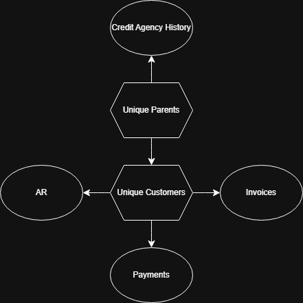

# Credit AR Analytics

A reference architecture for an Accounts Receivable (AR) analytics system built with a modern BI stack.  
This repository documents the data architecture, transformation logic, semantic model design, and validation practices for reliable AR reporting.

Note: System names, identifiers, and file names have been generalized to remove proprietary information. This repo contains no company data.

---

## What this project demonstrates

AR analytics often requires joining data across multiple operational systems. This project shows how to build a single semantic layer that supports:

- AR aging analysis (net of open credits)
- payment behavior analysis (timeliness based on application vs due date)
- credit exposure monitoring (AR plus operational exposure signals)
- parent-level reporting (customer rollups and credit context)
- invoice-level investigation workflows (detail outputs for operational use)

This repository is documentation-first and focuses on how the system is designed and validated.

---

## Architecture

High-level flow:

1. **Source systems**
   - ERP System (AR ledger detail, invoices, payments, credits, credit limits, payment terms)
   - Transportation Management System (shipment exposure signals)
   - Invoice System (not-invoiced or unbilled risk signals)
   - Reference files (parent mapping, credit agency history extracts, customer master tracker)

2. **Processing layer**
   - Azure Databricks SQL transformations (raw/bronze to curated to reporting outputs)

3. **Semantic layer**
   - Power BI dataset (dimensions, facts, measures, relationships)

4. **Consumption**
   - Interactive report(s)
   - Paginated reports for detailed operational outputs

See: `docs/architecture.md`

---

## Repository structure

```text
credit-ar-analytics/
├─ README.md
├─ docs/
│  ├─ architecture.md
│  ├─ technical-design.md
│  ├─ semantic-model.md
│  ├─ data-quality.md
│  ├─ operations-runbook.md
│  └─ glossary.md
├─ sql_examples/
│  ├─ core-ar-aging_example.sql
│  ├─ payment-breakdown_example.sql
│  └─ invoice-aging-detail_example.sql
└─ assets/
   ├─ architecture-diagram.png
   └─ semantic-model-diagram.png
```

---

## Semantic Model



The semantic model follows a hybrid star schema. Customer-level facts connect through the customer dimension, while credit agency data connects through the parent entity dimension.
## Core datasets

The analytics model is built around several curated datasets used by the semantic model.

**Aging (Core AR)**  
Customer-level dataset combining open invoice balances, aging buckets, open credits, payment summary signals, credit limits, and operational exposure indicators.

**Payment Breakdown**  
Dataset describing payment behavior by analyzing when payments are applied relative to invoice due dates.

**Invoices Detail**  
Invoice-level dataset used for operational investigation and paginated reporting outputs.

**Parents Mapping**  
Unified customer-to-parent mapping combining manual mappings with system-derived parent relationships.

**Credit Agency History**  
Parent-level credit agency history used to provide external credit context for customer groups.

Detailed dataset specifications are documented in:

`docs/technical-design.md`

---

## Skills demonstrated

This project demonstrates several BI and analytics engineering capabilities:

- dimensional and semantic modeling
- SQL transformation design
- data contract documentation (grain, outputs, validation)
- business rule translation into analytical datasets
- cross-system data integration
- operational reporting architecture

---

## Design decisions

Several design choices were made to improve reliability and maintainability.

• Credit aging uses credit age rather than allocating credits to invoices.  
This simplifies reconciliation and avoids unstable allocation logic.

• Parent-level credit reporting is separated from customer-level AR analysis.  
This allows credit risk context to be evaluated independently of operational entities.

• Operational exposure signals are treated as directional indicators rather than accounting totals.  
Shipment exposure is intended to highlight potential risk rather than reconcile exactly with AR balances.

---

## Data contracts

Each curated dataset in this architecture follows a defined data contract to ensure stability for downstream reporting and analytics.

A dataset contract defines:

- dataset grain
- required keys
- core output fields
- expected validation checks
- known limitations

Examples:

**Aging (Core AR)**  
Grain: one row per CustomerNo  
Key fields: CustomerNo, ParentName  
Core outputs: invoice AR, aging buckets, open credits, exposure indicators  
Validation: bucket totals equal invoice AR; exposure values non-negative

**Payment Breakdown**  
Grain: one row per CustomerNo, month, lateness bucket  
Core outputs: applied payment amounts by timeliness bucket  
Validation: no negative applied amounts; bucket ordering stable

**Invoices Detail**  
Grain: one row per open ledger item  
Core outputs: posting date, due date, days past due, document identifiers  
Validation: bucket totals equal open amount

Full dataset specifications and validation logic are documented in:

`docs/technical-design.md`

---

## Documentation

Full technical documentation is available in the `docs/` directory:

- architecture design
- dataset specifications
- semantic model structure
- data validation strategy
- operational runbook

Start with:

`docs/architecture.md`
